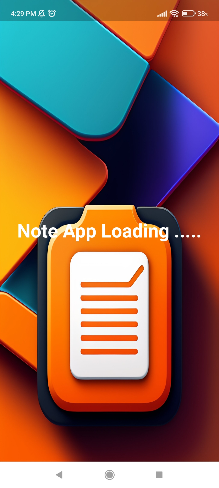

Note App
Note App is a simple Flutter application that allows users to create, view, edit, and delete notes. The app utilizes Provider for state management and shared_preferences for persisting notes data across app sessions. This can be run in both andriod and ios aswell as web.

The requriement.txt file contains the requriement packages for flutter and the docs.md conatins the overall description of applications

Therr is screenshot file in screenshot foler apk sample in apk folder

Table of Contents
Features
Screenshots
Installation
Usage
Dependencies
Contributing
License
Features
Create new notes with a title and description.
View and edit existing notes.
Delete notes when no longer needed.
Notes are automatically saved and retrieved using SharedPreferences.
<h1>Note App Screenshots</h1>
    

        
        
        
    

    

        
        
        
    

    

        
        
        
    

    

        
    

Installation
To run this application on your local machine, make sure you have Flutter installed. If not, follow the official Flutter installation guide: https://flutter.dev/docs/get-started/install

Clone this repository to your local machine:
bash

git clone https://github.com/your_username/NoteApp.git
cd NoteApp
Get the required packages:
bash

flutter pub get
Usage
Open the project in your favorite code editor (e.g., Visual Studio Code, Android Studio).
Ensure you have a compatible device or emulator connected.
Run the app:
bash

flutter run
Use the app to create, view, edit, and delete notes.
Dependencies
The following Dart packages are used in this project:

provider: State management solution for Flutter applications.
shared_preferences: Flutter plugin to store key-value data on the device.
To view the complete list of dependencies with their versions, refer to the pubspec.yaml file.

Contribution Guidelines
Contributions are welcome! If you find any bugs or have suggestions for improvements, please open an issue or create a pull request. To contribute, follow these steps:

Fork the repository.
Create a new branch for your changes:
bash

git checkout -b feature/new-feature
Make your changes and commit them:
bash

git commit -m "Add new feature"
Push your changes to your fork:
bash

git push origin feature/new-feature
Create a pull request from your forked repository.
Please ensure your code adheres to the project's coding standards and includes appropriate tests when necessary.

License
This project is licensed under the MIT License - see the LICENSE file for details.